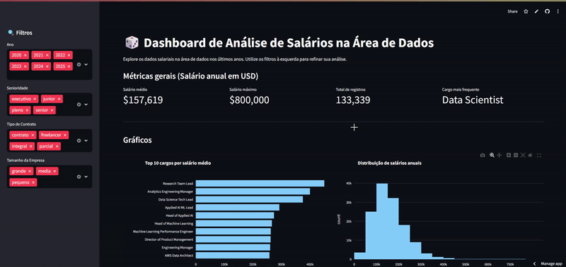

<h1>Imersão de dados com Python 🐍 </h1>

 <a href="https://imersao-dados-py-rh3zznasdzyzwp9bkefj6z.streamlit.app/
">Clique aqui e acesse o Site</a>

- Uso de Visual Studio Code em cojunto com o Google Colab, com a diferença de instalar e importar as libs.
- Biblioteca Pandas
- Biblioteca Numpy
- Biblioteca Seaborn
- Biblioca Plotly

  

 <h2>Desenvolvido junto com Alura 💙</h2> 
